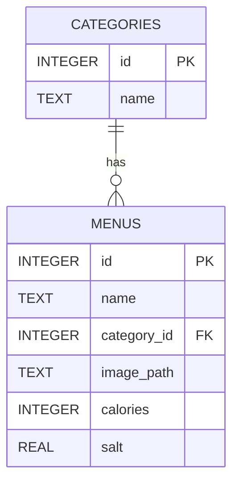

# データベース構成

## ER 図

## データ構造

### カテゴリマスタ (`categories`)

| KEY 名 | 説明        | データ型  | サンプル |
| ------ | ----------- | --------- | -------- |
| `id`   | カテゴリ ID | `INTEGER` | `1`      |
| `name` | カテゴリ名  | `TEXT`    | `貴族焼` |

### 商品マスタ (`menus`)

| KEY 名        | 説明             | データ型  | サンプル                           |
| ------------- | ---------------- | --------- | ---------------------------------- |
| `id`          | メニュー ID      | `INTEGER` | `101`                              |
| `name`        | メニュー名       | `TEXT`    | `もも貴族焼(たれ)`                 |
| `category_id` | カテゴリ ID      | `INTEGER` | `1`                                |
| `image_path`  | 画像パス         | `TEXT`    | `2024/03/momo_kizokuyaki_tare.jpg` |
| `calories`    | エネルギー(kcal) | `INTEGER` | `231`                              |
| `salt`        | 食塩相当量(g)    | `REAL`    | `1.9`                              |
